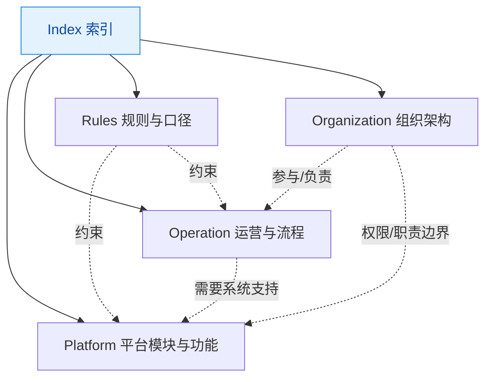

### 目的

本页用于给「📚 504 平台字典」的

### 总体原则（必须遵守）

- **一级分类尽量互斥**：同一条目只能归入一个一级分类。
- **Index 分类只做导航**：Index 不承载正文细节，只放入口、结构、链接。
- **既要给人看，也要给Agent看**

### 知识库概述

- 本知识库「📚 504 平台字典」服务平台产品团队，用于沉淀 *功能、流程、规则、术语、组织* 的统一口径，减少沟通歧义与返工。
- **使用方式**
    1. 先在 **Index** 找到主题入口或阅读路径。
    2. 遇到“这个词什么意思”先看 **Concept**。
    3. 遇到“必须怎么填/怎么算/如何验收”看 **Rules**。
    4. 遇到“事情怎么流转/下一步谁做”看 **Operation**。
    5. 遇到“平台里有什么能力/怎么用”看 **Platform**。
    6. 遇到“谁负责什么/权限职责边界”看 **Organization**。
- **写作要求**：一个条目只归属一个一级分类；正文不要写在 Index；Rules 里尽量链接 Concept 而不是重复定义。
- **推荐检索顺序**：Index →（按问题类型）Concept / Rules / Operation / Platform / Organization。

### 分类关系图（Mermaid）

- **Index** 是入口与导航。
- **Concept → Rules**：概念先定义，再形成可验收的规则。
- **Rules** 对 **Platform/Operation** 提供硬约束。
- **Operation** 描述业务流转，必要时引用 **Platform** 的系统支持点。
- **Organization** 提供角色/职责/权限边界，并参与流程执行。

以下是一级分类严格、可执行、可复用的**定义口径**，确保同一类内容不会被反复放错位置，降低检索与维护成本：

---

### Index 索引

**定义**

- 作为字典的**导航与入口**，提供结构化链接与阅读路径，不承载深度正文。

**收录标准**

- 目录页、地图页、主题入口页、阅读路径、常用链接集合。

**禁止项（Index 里不允许写）**

- 规则正文（→ Rules）。
- 流程正文（→ Operation）。
- 功能说明正文（→ Platform）。
- 术语定义正文（→ Concept）。

**推荐写法**

- 一级分类总入口
- Agent 和人都应该从这里开始了解整个知识库

---

### Platform 平台模块与功能

**定义**

- 记录平台提供的**模块、功能、页面、入口、交互与可见能力**，以及它们在产品层面的边界。

**收录标准（满足任一即应归入 Platform）**

- 这条内容能映射到“平台里一个可交付的功能点/页面/入口/按钮/配置”。
- 这条内容能够直接被写进 PRD 或需求说明的“功能描述/交互/权限/边界”。

**推荐写法（页面结构）**

- 功能一句话描述
- 入口与使用场景
- 关键交互与权限
- 边界与不做什么
- 关联：对应流程/规则/术语链接

---

### Operation 运营与流程

**定义**

- 记录业务如何运转的**流程、步骤、状态流转、角色协作**，强调“从输入到输出”的链路。

**收录标准**

- 这条内容主要回答“事情怎么走”“下一步是谁做”“到什么状态算完成”。
- 可以画成流程图或写成步骤清单，并且与具体产品页面无关也成立。

**推荐写法**

- 流程目标
- 角色与输入输出
- 步骤/状态机（可用编号或状态表）
- 异常分支与升级路径（如适用）
- 关联：平台支持点（Platform 链接）、规则约束（Rules 链接）

---

### Rules 规则与口径

**定义**

- 记录必须遵守的**统一口径、计算规则、命名规范、数据填写要求、校验/验收标准**，强调“可执行、可检查”。

**收录标准**

- 这条内容出现“必须/禁止/统一按…计算/满足…才算通过”等硬约束。
- 能被直接用来做验收清单、校验规则或对齐口径。

**推荐写法**

- 规则陈述（必须/禁止/允许）
- 口径定义（如涉及计算：输入、公式口径、边界条件、示例）
- 检查方式（如何验证、验收条件）
- 例外与版本（如适用）
- 关联：概念前置（Concept 链接）、流程节点（Operation 链接）

---

### Concept 名词概念

**定义**

- 记录跨团队沟通需要对齐的**术语定义、概念边界、易混点与反例**，强调“是什么”。

**收录标准**

- 这条内容主要回答“这个词是什么意思”“包含什么/不包含什么”。
- 需要消除歧义，避免同词不同义。

**推荐写法**

- 一句话定义
- 范围与边界（包含/不包含）
- 常见误解（至少 1 条）
- 示例与反例（如适用）
- 关联：对应规则（Rules）、流程节点（Operation）、功能入口（Platform）

---

### Organization 组织架构

**定义**

- 记录与平台/流程相关的**组织单元、角色、职责边界与协作关系**，强调“谁负责什么”。

**收录标准**

- 这条内容描述部门、岗位、角色、责任边界（RACI 亦可），或组织结构。

**推荐写法**

- 组织/角色定义
- 主要职责与不负责范围
- 上下游协作接口（向谁要什么/输出什么）
- 关联：对应流程（Operation）、对应功能权限（Platform）

---

### 归类快速判别（30 秒版）

- “这是平台有什么能力/怎么用” → **Platform**
- “这件事怎么流转/下一步谁做” → **Operation**
- “必须怎么填/怎么算/怎么验收” → **Rules**
- “这个词到底是什么意思” → **Concept**
- “谁负责什么/组织怎么分” → **Organization**
- “我想找入口/地图/阅读路径” → **Index**