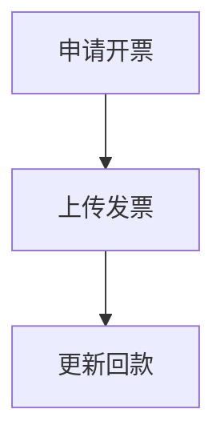

---
title: "电子签（含设计文件/非设计文件签署）"
aliases: []
tags: [platform, 504平台, 01平台架构]
category: "Platform 平台模块与功能"
updated: "2026年2月26日 11:00"
folder: "01_平台架构"
source: "Notion导出"
source_file: "电子签（含设计文件 非设计文件签署） 253711a5c7b6808799e9dc9620d55a14.md"
---

## 流程

## 申请开票

### **基本信息**

- 申请时间
- 业务类别
    - 包括以下选项
        - 设计
        - 咨询
        - 建筑安装
        - 设备、材料销售
        - EPC
        - PMC
        - 设计咨询
        - 供应链
- 签署主体
- 客户名称
- 选择帐号
- 税号

### **开票项目 (列表)**

- 项目编号
    - ⚠️ 只有项目经理和CRB申请人可以选择到项目
    - 框架的项目经理可以在开票项目中选择到自己框架下的工作单
- 项目名称
- 项目经理
- 价税合计

**其他字段**

- 价税合计（总额）
- WIP 时间
    - 包括以下选项
        - 当年 WIP
        - 历年 WIP
- 税额
- 金额
- 发票摘要
    - 包括以下选项
        - 设计服务*设计费
        - 鉴证咨询服务*技术服务费
        - 鉴证咨询服务*技术咨询费
        - 鉴证咨询服务*可研编制费
        - 鉴证咨询服务*项目管理费
        - 鉴证咨询服务*造价咨询服务费
        - 鉴证咨询服务*咨询服务费
        - 设计服务*EPCm设计服务费
        - 建筑服务*建筑安装（农民工工资）
        - 建筑服务*建筑安装工程费
        - 销售明细详见邮件附件
        - 研发和技术服务*技术服务费
- 发票备注
- 补充说明
- 上传开票依据

### 提示

- 当有项目填写的申请开票额大于其合同额（含变更）时，增加提示：项目XXX的累计申请开票金额xxx元超出项目的合同额xxx元，是否仍然确认提交？
    - ⚠️ 仅提示，不限制提交。
- 不允许框架合同开票

## 上传发票

- 发票扫描件
- 上传快递凭证
- 开票时间
    - 无限制，可以填任意一天

## 更新回款

- 回款状态
    - 当“全部回款”后，无法再更新回款状态
- 回款时间
    - 无限制，可以填任意一天
- 累计回款金额
    - 回款金额可以输入负值

## Q&A

- Q：接收不到短信验证码？