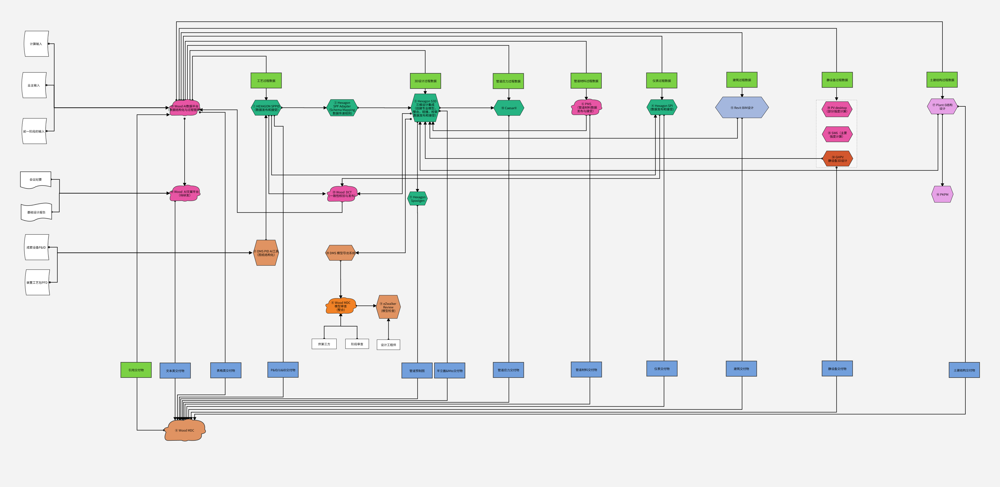

# 设计流程改造框架

## 设计说明

> **核心理念**：基于工程设计数据源，以数据驱动，对 **12 个设计专业**（工艺、管道、仪表、土建结构、静设备、电气、电信、管道材料、管道应力、给排水消防、建筑、暖通）进行流程改造。根据数据输入、P&ID 图纸结构化转化，以工程设计过程条件数据的传递顺序及交付物的数据组织形式，表达数据的传递顺序。

### 颜色编码说明
|               颜色                | 含义                  |
| :-----------------------------: | :------------------ |
|      🟢 **草青色** `#7BD144`       | 过程条件数据的传递           |
|      🔵 **天蓝色** `#729FDC`       | 交付物的数据传递            |
|       🟣 **粉色** `#e855a4`       | 伍德中国自主研发软件及平台       |
| 🟠 **橙色** `#e09362` / `#f28226` | 伍德自研审查/导出系统         |
|     🟢 **海克斯康绿** `#26b382`      | HEXAGON 系列工具        |
|   🔵 **Autodesk蓝** `#A4B7DE`    | Revit 等 Autodesk 工具 |
|      🟣 **土建粉** `#e6a1e6`       | Plant-S / PKPM      |

### 软件定位
各个专业的工程软件既承担**数据的载体**，也是**数据的创造平台**。

---

## 1. 框架全景图



---

## 2. 元素清单（按类型）

### 2.1 输入层（7类文档输入）
| 名称 | 颜色 |
|:---|:---|
| 计算输入 | 白 |
| 业主输入 | 白 |
| 前一阶段的输入 | 白 |
| 会议纪要 | 白 |
| 基础设计报告 | 白 |
| 成套设备 P&ID | 白 |
| 装置工艺包 PFD | 白 |

### 2.2 AI 平台层（🟣 伍德自研）
| 编号 | 名称 | 功能 | 状态 |
|:---:|:---|:---|:---|
| ㉓ | **Wood AI 数据平台** | 数据结构化与过程管理 | 已建 |
| ㉕ | **Wood AI 文案平台** | 文案处理 | 待研发 |

### 2.3 数据源层（🟢 草青色 — 过程条件数据）
| 名称 |
|:---|
| 工艺过程数据 |
| 3D 设计过程数据 |
| 管道应力过程数据 |
| 管道材料过程数据 |
| 仪表过程数据 |
| 建筑过程数据 |
| 静设备过程数据 |
| 土建结构过程数据 |

### 2.4 工具/系统层（按厂商/颜色分类）

#### HEXAGON 海克斯康系列（🟢 `#26b382`）
| 编号  | 工具名称                    | 功能                              |
| :-: | :---------------------- | :------------------------------ |
|  ①  | **HEXAGON SPPID**       | 工艺（数据发布和接受）                     |
|  ②  | **Hexagon SPF Adapter** | Schema Mapping 数据传递规则           |
|  ③  | **Hexagon S3D**         | 三维设计集成（创建专业模型，整合，碰撞，校审，数据发布和接受） |
|  ④  | **Hexagon SPI**         | 仪表（数据发布和接受）                     |
|  ⑪  | **Hexagon Spoolgen**    | 管道预制                            |

#### 伍德自研 — 工艺/管道/仪表（🟣 `#e855a4`）
| 编号  | 工具名称               | 功能          |
| :-: | :----------------- | :---------- |
|  ⑥  | **PMS**            | 管道材料数据发布与接受 |
|  ㉑  | **DMS P&ID AI 工具** | 图纸结构化       |
|  ㉕  | **Wood DCT**       | 一致性校验与发布    |

#### 伍德自研 — 静设备（🟣/🟠）
| 编号  | 工具名称           | 功能        |
| :-: | :------------- | :-------- |
|  ㉟  | **SW6**        | 主要强度计算    |
|     | **PV desktop** | 部分强度计算    |
|  ㉞  | **GHPV**       | 静设备 3D 设计 |

#### 伍德自研 — 土建结构（🟣 `#e6a1e6`）
| 编号 | 工具名称 | 功能 |
|:---:|:---|:---|
| ⑰ | **Plant-S** | 结构设计 |
| ⑯ | **PKPM** | 结构计算 |

#### 其他厂商
| 编号 | 工具名称 | 厂商 | 功能 |
|:---:|:---|:---|:---|
| ⑩ | **Caesar II** | Bentley | 管道应力分析 |
| ⑮ | **Revit BIM** | Autodesk | 建筑设计 |

#### 伍德自研 — 审查/导出系统（🟠）
| 编号 | 工具名称 | 功能 |
|:---:|:---|:---|
| ㉙ | **DMS 模型导出系统** | 模型导出 |
| ⑧ | **Wood MDC** | 模型审查（整合） |
| ⑨ | **eZwalker Review** | 模型检查 |
| ⑧ | **Wood MDC**（底部云） | 总汇聚点 |

### 2.5 参与人员
- 供第三方
- 阶段审查
- 设计工程师

### 2.6 交付物层（🔵 天蓝色 — 交付物数据）
| 名称 | 颜色 |
|:---|:---|
| 引用交付物 | 🟢 草青色 |
| 文本类交付物 | 🔵 天蓝色 |
| 表格类交付物 |  天蓝色 |
| P&ID/U&ID 交付物 | 🔵 天蓝色 |
| 管道预制图 | 🔵 天蓝色 |
| 平立面 & Mto 交付物 | 🔵 天蓝色 |
| 管道应力交付物 | 🔵 天蓝色 |
| 管道材料交付物 | 🔵 天蓝色 |
| 仪表交付物 | 🔵 天蓝色 |
| 建筑交付物 | 🔵 天蓝色 |
| 静设备交付物 | 🔵 天蓝色 |
| 土建结构交付物 | 🔵 天蓝色 |

---

## 3. 完整数据流向与关系（基于 LogicFlow 源数据）

### 3.1 输入 → AI 平台
```
计算输入 ────────┐
业主输入 ────────┤
前一阶段的输入 ──┼──→ ㉓ Wood AI 数据平台
                 │
会议纪要 ────────┤
基础设计报告 ────┘──→ ㉕ Wood AI 文案平台（待研发）

㉓ Wood AI 数据平台 ──→  Wood AI 文案平台
```

### 3.2 AI 平台 → 专业工具（核心辐射）
**Wood AI 数据平台向所有专业工具分发数据：**
```
 Wood AI 数据平台 ──→ ① SPPID（工艺）
 Wood AI 数据平台 ──→ ③ S3D（3D 设计）
㉓ Wood AI 数据平台 ─→ ⑩ Caesar II（管道应力）
㉓ Wood AI 数据平台 ──→ ⑥ PMS（管道材料）
 Wood AI 数据平台 ──→ ④ SPI（仪表）
㉓ Wood AI 数据平台 ──→ ⑮ Revit（建筑）
㉓ Wood AI 数据平台 ──→ ⑰ Plant-S（土建）
```

### 3.3 专业工具间协同
```
① SPPID ─→ ② SPF Adapter ──→ ③ S3D（工艺→3D 设计主链路）

⑥ PMS ──→ ③ S3D（管道材料数据回流至 3D）
⑰ Plant-S ──→  S3D（土建结构数据流入 3D）
⑮ Revit ──→ ③ S3D（建筑模型汇入 3D）
㉞ GHPV ──→ ③ S3D（静设备 3D 设计汇入）

① SPPID ──→ ④ SPI（工艺数据传递给仪表）
㉑ DMS P&ID AI ──→ ① SPPID（图纸结构化后给工艺）

③ S3D ──→ ⑪ Spoolgen（3D 设计输出到管道预制）
③ S3D ──→ ⑩ Caesar II（3D 数据传递给应力分析）
```

### 3.4 一致性校验链（Wood DCT）
```
① SPPID ──→ ㉕ Wood DCT
③ S3D  ──→ ㉕ Wood DCT
④ SPI  ──→ ㉕ Wood DCT

㉕ Wood DCT ──→ ㉓ Wood AI 数据平台（校验结果回传）
```

### 3.5 模型审查链
```
③ S3D ──→  DMS 模型导出系统 ──→ ⑧ Wood MDC 模型审查 ──→ ⑨ eZwalker Review

供第三方 ─→ ⑧ Wood MDC
阶段审查 ──→ ⑧ Wood MDC
设计工程师 ──→ ⑨ eZwalker Review
```

### 3.6 数据汇聚（Wood MDC）
```
所有专业工具 ──→ ⑧ Wood MDC（总汇聚点）
① SPPID ──→ ⑧ Wood MDC
 S3D  ──→ ⑧ Wood MDC
⑥ PMS  ──→ ⑧ Wood MDC
④ SPI  ──→  Wood MDC
⑮ Revit ──→ ⑧ Wood MDC
⑰ Plant-S ──→ ⑧ Wood MDC
⑩ Caesar II ──→  Wood MDC
⑪ Spoolgen ──→ ⑧ Wood MDC
 GHPV ──→ ⑧ Wood MDC

⑧ Wood MDC ─→ ㉓ Wood AI 数据平台（汇聚数据回流）
㉕ Wood AI 文案平台 ──→  Wood MDC
```

### 3.7 静设备内部计算流
```
静设备过程数据 ──→ ㊴ PV desktop（部分强度计算）
静设备过程数据 ─→ ㉟ SW6（主要强度计算）

㉟ SW6 ──→ ㉞ GHPV（强度计算结果传递给 3D 设计）
```

---

## 4. 伍德自研工具矩阵

| 类别 | 工具 | 编号 | 功能 |
|:---|:---|:---:|:---|
| **AI 平台** | Wood AI 数据平台 | ㉓ | 数据结构化与过程管理 |
| | Wood AI 文案平台 |  | 文案处理（待研发） |
| **工艺/管道** | PMS |  | 管道材料数据发布与接受 |
| | DMS P&ID AI 工具 |  | 图纸结构化 |
| | Wood DCT | ㉕ | 一致性校验与发布 |
| **静设备** | SW6 | ㉟ | 主要强度计算 |
| | PV desktop | ㊴ | 部分强度计算 |
| | GHPV | ㉞ | 静设备 3D 设计 |
| **土建结构** | Plant-S | ⑰ | 结构设计 |
| | PKPM | ⑯ | 结构计算 |
| **审查/导出** | DMS 模型导出系统 | ㉙ | 模型导出 |
| | Wood MDC | ⑧ | 模型审查 + 总汇聚 |
| | eZwalker Review | ⑨ | 模型检查 |

> **关键洞察**：伍德中国不仅提供 AI 平台层，还在工艺、管道、静设备、土建、审查等核心环节拥有完整的自研工具链，形成"平台 + 工具 + 审查"的闭环能力。

---

## 5. 架构层级总结

```
┌──────────────────────────────────────────────┐
│  输入层：7 类文档输入                          │
──────────────────────────────────────────────┤
│  AI 平台层：Wood AI 数据平台 + 文案平台（🟣）   │
│     ↓ 数据辐射分发                             │
├──────────────────────────────────────────────┤
│  工具层：HEXAGON + 伍德自研 + 其他厂商          │
│     ├── 专业工具间协同（SPPID→S3D 主链路）      │
│     ├── 一致性校验链（→Wood DCT→回传）          │
│     └── 模型审查链（→DMS导出→Wood MDC→eZwalker）│
├──────────────────────────────────────────────┤
│  交付物层：12 类专业交付物（）                │
├──────────────────────────────────────────────┤
│  总汇聚：Wood MDC ←→ Wood AI 数据平台（闭环）   │
└──────────────────────────────────────────────┘
```

---

## 6. 待补充专业

以下专业在当前框架图中尚未完全展开：

| 专业 | 状态 |
|:---|:---|
| 电气 | 待补充数据源节点与工具 |
| 电信 | 待补充数据源节点与工具 |
| 给排水消防 | 待补充数据源节点与工具 |
| 暖通 | 待补充数据源节点与工具 |
