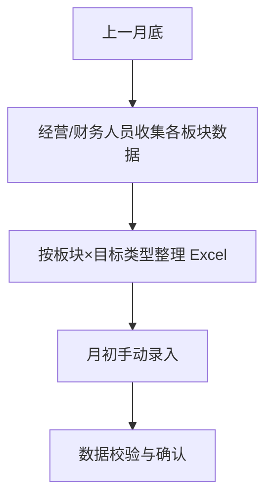

---
aliases:
  - 月度数据设置，月度经营数据，Monthly Data Setup
tags:
  - data
  - 504平台
  - 03数据与规则
category: Data 数据与规则
subcategory: 经营数据
updated: 2026-04-28
related: "[[项目交付]]"
---
# 月度数据设置

## 功能定位
**项目交付板块月度经营数据管理**。用于按月维护各项目执行板块的核心经营指标，支撑公司经营分析、绩效考核与业务决策。

## 核心机制
- **导入周期**：每月初由专人手动导入上月数据
- **数据维度**：`年` × `月` × `板块` × `目标类型`
- **板块范围**：覆盖所有**项目执行板块**（含各中心、各业务板块）

---

## 数据字段说明

| 字段             | 类型  | 说明                                               |
| :------------- | :-- | :----------------------------------------------- |
| **年份**         | 选择  | 数据归属年份（如 2026 年）                                 |
| **月份**         | 选择  | 数据归属月份（1-12 月）                                   |
| **板块**         | 选择  | 项目执行板块名称（如 金山中心、PMC 板块、新材料板块等）                   |
| **目标类型**       | 选择  | 业务类型分类：<br>• **设计及咨询**<br>• **EPC**<br>• **PMC** |
| **存量合同额 (万元)** | 数值  | 截至当月底累计在手合同总额                                    |
| **WIP (万元)**   | 数值  | Work In Progress，在实施项目累计确认产值                     |
| **应收账款 (万元)**  | 数值  | 已确认收入但尚未收到的款项                                    |
| **完成合同额 (万元)** | 数值  | 当月新签合同金额                                         |
| **完成开票额 (万元)** | 数值  | 当月实际开具发票金额                                       |
| **完成回款额 (万元)** | 数值  | 当月实际收到款项金额                                       |

---

## 数据逻辑

### 1. 板块 × 目标类型矩阵
每个板块可对应 1-3 种目标类型，数据**按类型独立核算**：

| 板块示例 | 目标类型 |
| :--- | :--- |
| **金山中心** | 设计及咨询、EPC |
| **PMC 板块** | PMC |
| **新材料板块** | 设计及咨询、EPC、PMC |
| **供应链板块** | PMC、设计及咨询 |
| **模块化板块** | PMC |

### 2. 指标关系
```
存量合同额 = 历史累计在手合同（滚动值）
WIP        = 在实施项目累计确认产值（滚动值）
完成合同额 = 当月新签（月度值）
完成开票额 = 当月开票（月度值）
完成回款额 = 当月回款（月度值）
应收账款   = 已确认未收款（滚动值）
```

---

## 业务流程



## 使用场景
1. **月度经营分析会**：快速拉取各板块当月业绩与累计指标
2. **绩效考核**：按目标类型核算板块完成进度
3. **现金流管理**：通过应收账款、开票额、回款额监控资金健康度
4. **业务预测**：结合存量合同额与 WIP 评估未来产能负荷

---

## 注意事项
- ⚠️ **存量类指标**（存量合同额、WIP、应收账款）为**累计值**，需确保与上月数据衔接
-  **流量类指标**（完成合同额、开票额、回款额）为**当月值**，仅统计本月发生额
-  同一板块不同目标类型的数据**不可合并计算**，需分别维护
